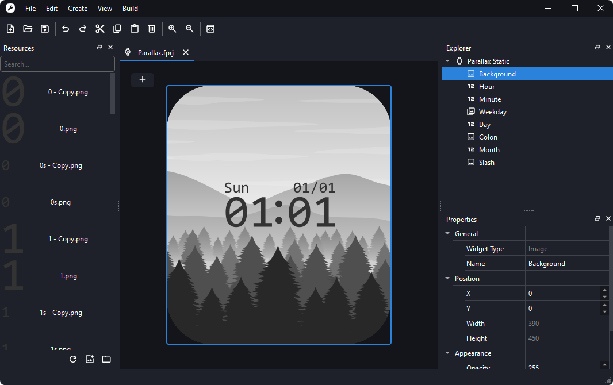

## Note

I modified a .db file and some scripts to be able to load an editor for mi watch lite - idk if that will compile well enough to work
Dont use this yet - I gotta confirm everything works

Active.bin - legit xiaomi mi lite watch watchface
MojSat/ - folder with my test-project

## --

 
<h2 align="center"> Mi Create </h2>

 Unofficial watchface creator for Xiaomi Wearables. Compatible with all Xiaomi wearables made ~2021 and above 

    
    

## Features:
- Shockingly simple & good looking user interface
- Easy to learn (especially for EasyFace users)
- Uses native libraries, meaning its really fast
- Multilingual

## Installation:

### Windows
Download the latest installer from the [releases](https://github.com/ooflet/Mi-Create/releases) tab. Please note only 64-bit versions of Windows 10 (1809 or later) and Windows 11 is supported.

### Linux
Mi Create fully supports Linux, however there are no binaries for Linux. I do plan to distribute binaries on Linux once a fully stable and feature-rich release is out. If there are any Linux app maintainers who have experience in distributing applications, I would highly appreciate your help.

## Running source code
If you want to run from source:
- Clone repo
- Install Python version 3.12 or above & install dependencies:
`pip install -r requirements.txt` or `python -m pip install -r requirements.txt`
- Execute main.py

Executing from source however will not create log files, it will output logs to console.

## Troubleshooting
Mi Create can end up running into a few bugs. Please report them with the main log file attached. If you have not changed the install location on Windows during setup, the main log file will be located at  
`C:\Users\{username}\AppData\Local\Programs\Mi Create\data\app.log`

## Help
If you are looking for a tutorial on Mi Create, please view the documentation at https://ooflet.github.io/docs. If you have any further questions that are not covered by the documentation, feel free to ask on the [discussions](https://github.com/ooflet/Mi-Create/discussions) tab. Otherwise, if there is a bug or issue with Mi Create, submit an [issue](https://github.com/ooflet/Mi-Create/issues) report.

## Redistribution

I do not mind the program being redistributed, however please link the Github repository somewhere whether it be the post or the description.

Compiling for different platforms must be done using Nuitka, there are some specific compiled checks special for Nutika in the program. Plus, Nutika gives an added performance benefit.

## Licensing:
Mi Create is licensed under the GPL-3 licence. [View what you can and can't do](https://gist.github.com/kn9ts/cbe95340d29fc1aaeaa5dd5c059d2e60)   
Please note that the compiler & decompiler is made by a third party and is **NOT** open source.
